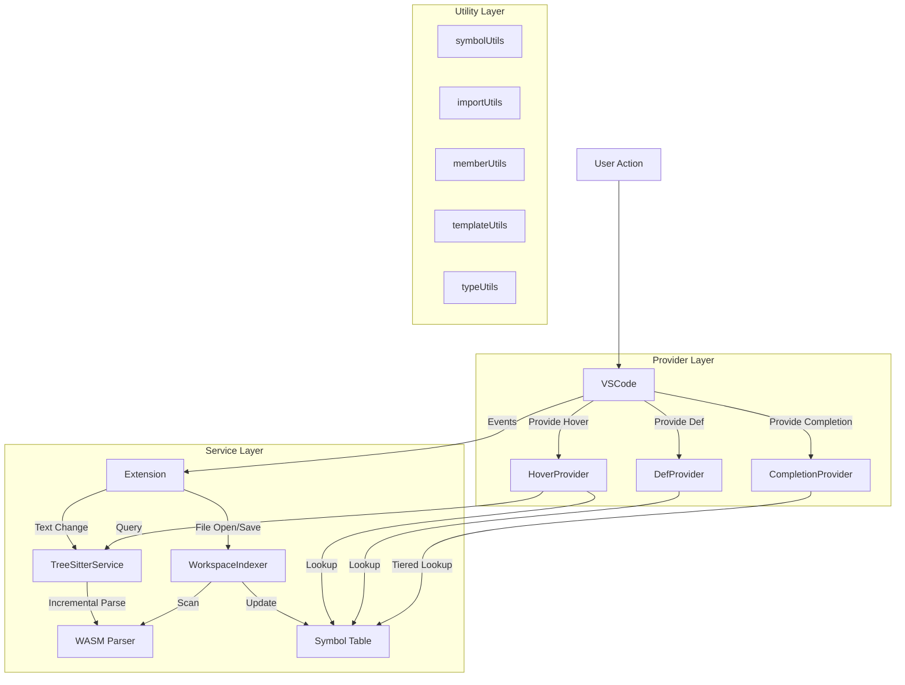

# Kanagawa "LSP-Lite" VS Code Extension Plan

This document outlines the architecture and implementation plan for a lightweight, high-performance VS Code extension for the Kanagawa language. It leverages **Tree-sitter** (via WebAssembly) to provide IDE-like features without requiring a heavy external language server process.

## 1. Core Philosophy: "LSP-Lite"

*   **In-Process:** Runs entirely within the VS Code Extension Host.
*   **Zero Dependency:** No Python, Haskell, or C++ runtime required for the user.
*   **Syntactic + Heuristic:** Uses the syntax tree for 100% accuracy on structure, and heuristics for semantic features (types, cross-file references) where a full compiler is too heavy.
*   **Performance:** Uses incremental parsing (Tree-sitter) and a lightweight in-memory index for workspace symbols.

## 2. Architecture Overview

The extension consists of four main layers:

1.  **The Parser Layer (WASM):** `web-tree-sitter` loading `tree-sitter-kanagawa.wasm`.
2.  **The Service Layer (TypeScript):**
    *   `TreeSitterService`: Manages parsing, tree caching, and query execution with thread-safe mutex serialization.
    *   `WorkspaceIndexer`: Scans files to build a symbol/doc map with qualified names and smart cache invalidation.
    *   `QueryManager`: Manages Tree-sitter S-expression queries.
3.  **The Utility Layer (TypeScript):**
    *   `symbolUtils.ts`: Qualified name computation, module matching.
    *   `importUtils.ts`: Import resolution, accessibility filtering.
    *   `memberUtils.ts`: Member resolution, container matching.
    *   `templateUtils.ts`: Template parsing and instantiation.
    *   `typeUtils.ts`: Type inference and normalization.
    *   `nodeUtils.ts`: Common Tree-sitter node operations (findIdentifierNode, nodeToRange, etc.).
    *   `debounce.ts`: Document change debouncing utilities.
4.  **The Provider Layer (VS Code API):** Adapters that translate internal data into VS Code objects (`Hover`, `Definition`, `SemanticTokens`, `Completion`, `Rename`).



## 3. Detailed Feature Implementation

### 3.1. The Workspace Indexer (Cross-File Symbols)
**Goal:** Enable "Go to Definition" and "Hover" for symbols defined in other files (e.g., `import data.fifo`).

*   **Data Structure:**
    ```typescript
    interface SymbolInfo {
        name: string;                    // Simple name (e.g., "push")
        qualifiedName: string;           // Full path (e.g., "data.fifo::FIFO::push")
        uri: vscode.Uri;
        range: vscode.Range;
        kind: vscode.SymbolKind;
        category: SymbolCategory;        // 'class', 'method', 'field', etc.
        scopePath: string[];             // Enclosing scopes
        detail?: string;                 // e.g., "class FIFO<T, N>"
        signature?: string;              // Method signature with types
        typeHint?: string;               // Inferred or declared type
        docMarkdown?: string;            // Extracted from //| comments
    }

    interface QualifiedSymbolIndex {
        byName: Map<string, SymbolInfo[]>;           // Quick lookup by simple name
        byQualifiedName: Map<string, SymbolInfo[]>;  // Exact lookup by qualified name
        byModule: Map<string, SymbolInfo[]>;         // Module-scoped lookup
    }
    ```
*   **Lifecycle:**
    1.  **Startup:** `vscode.workspace.findFiles('**/*.k')`.
    2.  **Batch Scan:** Parse all files (using a shared Tree-sitter parser instance).
    3.  **Extraction:** Run a `definitions.scm` query to find:
        *   `module_declaration`
        *   `class_definition`
        *   `function_definition`
        *   `global_variable_declaration`
    4.  **Update:** On `workspace.onDidSaveTextDocument`, re-parse and update entries for that file.
*   **Performance Note:** Parsing 100+ files is fast (<1s), but we should `yield` to the event loop periodically to avoid freezing the UI during the initial scan.

### 3.2. Docblock Comments (`//|` and `//<`)
**Goal:** Show rich documentation in hovers.

*   **Grammar Requirement:** The `grammar.js` must expose comments as distinct nodes, or we must query for them. Ideally, we define specific rules for doc comments if the syntax allows, or just match `comment` nodes starting with `//|`.
*   **Extraction Logic:**
    *   **Pre-doc (`//|`):** Look for comment nodes *immediately preceding* a definition node.
    *   **Post-doc (`//<`):** Look for comment nodes *immediately following* a definition node (on the same line).
*   **Storage:** Clean the comment markers (`//|`, `//<`) and store the text in the `SymbolIndex`.

### 3.3. Heuristic Type Resolution & Hover
**Goal:** Provide useful type info without a full type checker.

*   **Strategy:** "Best Effort" Deduction.
*   **Scenario A: Explicit Types**
    *   Code: `uint32 count = 0;`
    *   Logic: Tree has `(type_identifier) @type`. We grab "uint32".
*   **Scenario B: Constructor Inference (`auto`)**
    *   Code: `auto q = FIFO<int>();`
    *   Logic:
        1.  Identify `auto` variable `q`.
        2.  Look at RHS `call_expression`.
        3.  Get function name `FIFO`.
        4.  Check if `FIFO` is a known class in `SymbolIndex`.
        5.  If yes, infer type is `FIFO`.
*   **Scenario C: Cast Inference**
    *   Code: `auto x = cast<float>(y);`
    *   Logic: Match `cast_expression` and extract the template argument.
*   **Fallback:** If deduction fails, the Hover simply shows the definition line (e.g., `(variable) auto x`) and any attached doc comments.

### 3.4. Syntax Highlighting & Visuals
**Goal:** Rich, semantic coloring.

*   **Implementation:** `DocumentSemanticTokensProvider`.
*   **Query (`highlights.scm`):**
    ```scm
    (function_definition name: (identifier) @function)
    (call_expression function: (identifier) @function)
    (type_identifier) @type
    (attribute name: (identifier) @attribute)
    ```
*   **Mapping:** Map `@function` -> `vscode.SemanticTokenTypes.function`, etc.

### 3.5. Document & Workspace Symbol Filtering
**Goal:** Provide curated navigation views for large Kanagawa projects.

*   **Configuration:** `kanagawa.outline.categoryFilter` controls which symbol categories appear (modules, classes, functions, etc.). Empty list = show everything.
*   **Module Prefix:** `kanagawa.outline.modulePrefix` limits the view to modules starting with a specific namespace prefix (e.g., `data.` or `control.async`).
*   **Commands:**
    *   `Kanagawa: Select Outline Categories` – interactive multi-select quick pick.
    *   `Kanagawa: Set Outline Module Prefix` – prompt for prefix string.
    *   `Kanagawa: Clear Outline Module Prefix` – reset filter.
*   **Workspace Symbols:** The new workspace symbol provider respects the same filters, so `Ctrl+T` (or `Go to Symbol in Workspace`) surfaces results consistent with the outline.
*   **Implementation Notes:** Filters are managed by `OutlineFilterManager`, which listens for configuration changes and notifies document/workspace symbol providers to refresh.

### 3.6. Configurable Import Search Paths
**Goal:** Allow projects to reference Kanagawa sources outside the workspace tree while keeping per-user overrides easy to manage.

*   **Workspace Configuration (`kanagawa.config.json`):** Optional JSON file at the root of the workspace. Example:
    ```json
    {
        "importPaths": [
            "../vendor/kanagawa-lib",
            "build/generated"
        ],
        "stdlibPath": ".kanagawa/stdlib"
    }
    ```
    Relative entries are resolved against the workspace root.
*   **User Settings (`kanagawa.compiler.*`):** Two new VS Code settings live under the `Kanagawa` category:
    *   `kanagawa.compiler.importPaths`: Array of additional search roots.
    *   `kanagawa.compiler.stdlibPath`: Optional override for the standard library.
    Settings paths are resolved relative to the workspace and take precedence over workspace JSON values.
*   **Merge Strategy:** The `ImportConfigService` loads workspace entries first, then appends user settings (deduplicated after normalization). Standard library overrides follow the same precedence (settings win over workspace; both beat defaults).
*   **Live Updates:** The service watches the workspace file and listens for configuration changes. Updates clear cached lookup data and schedule a full re-index, so new search roots are scanned automatically without a manual reload.
*   **Index Coverage:** When indexing, the extension now walks each configured import root (skipping common build folders) and indexes every `*.k` file it finds, alongside the main workspace tree.

### 3.7. Template-Aware Symbol Resolution
**Goal:** Improve semantic queries within templated code.

*   **Template Parameters:** Extracted from any `*_template` wrapper and surfaced as `SymbolInfo` entries scoped to their enclosing declaration. They are treated as constants (for `auto`/typed parameters) or aliases (for `typename`/template parameters) so hovers, completions, and type deduction resolve them like ordinary locals.
*   **Parameter Docs:** Inline `//<` comments attached to template parameters are captured as per-parameter documentation (shown on hover) while being stripped from displayed signatures.
*   **Alias Relationships:** `using` declarations now populate the alias map with canonical targets, and symbol resolution falls back through template-stripped identifiers and alias chains (`Foo<int>` → `Foo` → canonical type).
*   **Template Instantiations:** Call/lookup helpers normalize template arguments when searching for symbols; `inferTypeFromExpression` recognizes `template_instantiation` nodes so expressions like `Foo<int>.member` or `Foo<int>()` receive proper type hints.
*   **Member Lookups:** `resolveMemberSymbol` benefits from the normalized object types, allowing chained member inference on instantiated templates.

### 3.8. Advanced Symbol Resolution (Symbol Upgrade Plan)
**Goal:** Provide precise, import-aware symbol resolution with confidence scoring.

#### 3.8.1. Qualified Symbol Index
Symbols are now indexed by fully-qualified names (`module::Class::member`), enabling exact lookups:
```typescript
// Resolution methods
computeQualifiedName(symbol)      // Builds "data.fifo::FIFO::push"
resolveQualified(qualifiedName)   // Exact lookup
resolveInModule(modulePath, name) // Scoped lookup
getExportsForModule(modulePath)   // Get module's exported symbols
```

#### 3.8.2. Import-Aware Resolution
Resolution now respects file imports, with priority ordering:
1. **Locals:** Parameters, variables in scope (highest priority)
2. **Same-module:** Symbols defined in the current module
3. **Imported:** Symbols from explicitly imported modules
4. **Global:** Fallback to all symbols (lowest priority)

```typescript
interface ResolvedImports {
    currentModule?: string;
    importedModules: Set<string>;
    aliasToModule: Map<string, string>;
    accessibleQualifiedNames: Set<string>;
}
```

#### 3.8.3. Precise Member Resolution
Member expressions (`obj.method()`) resolve to exactly one symbol when types are known:
```typescript
interface MemberResolutionResult {
    symbol: SymbolInfo;
    confidence: 'exact' | 'high' | 'medium' | 'low' | 'none';
    alternatives?: SymbolInfo[];
}
```

#### 3.8.4. Template Instantiation
Template types like `FIFO<uint32, 32>` have their member signatures instantiated:
```typescript
interface TemplateInstantiation {
    baseType: string;                      // "FIFO"
    substitutions: Map<string, string>;    // T → uint32, N → 32
    instantiatedType: string;              // "FIFO<uint32, 32>"
}

// Key functions (templateUtils.ts)
parseTemplateType(typeName)               // Extract base and arguments
parseTemplateArguments(argsString)        // Handle nested templates
createInstantiation(base, params, args)   // Build substitution map
substituteParameters(signature, subs)     // Replace T with actual type
instantiateMethodSignature(sig, inst)     // Apply to member signatures
getInstantiatedReturnType(sig, inst)      // Get return type after substitution
```

**Multi-step Template Propagation:** Nested templates propagate parameters correctly:
```kanagawa
template<typename T>
class Wrapper {
    FIFO<T, 32> fifo;           // T propagates to FIFO
    T getValue() {
        return fifo.dequeue();   // Returns T, resolves to uint32 when Wrapper<uint32>
    }
}
```

### 3.9. Signature Help (Parameter Hints)
**Goal:** Surface live call signatures with active-parameter highlighting.

#### 3.9.1. Function Signature Help
*   **Provider:** `KanagawaSignatureHelpProvider` hooks into VS Code's signature help API for `.k` files, triggering on `(`, `,`, and `)` while inside argument lists.
*   **Source:** Pulls `SymbolInfo.signature` and doc comments from the indexer; matches are resolved with the same logic as definitions (member-aware first, then global scope).
*   **Active Parameter:** Calculated from the syntax tree by tracking the cursor's position relative to the call's `argument_list`, respecting nested generics and inline expressions.
*   **Templated Calls:** Works seamlessly with member expressions and template instantiations, leveraging the alias-aware resolver to present the most relevant overload.

#### 3.9.2. Template Signature Help
*   **Trigger:** The `<` character triggers template signature help when following a template class or function name:
    ```kanagawa
    FIFO<|>              // Shows: T: type, N: value
    Map<string, |>       // Highlights active parameter
    ```
*   **Active Parameter:** Tracks comma positions within angle brackets to highlight the current template parameter.
*   **Context Detection:** Two-phase detection:
    1. **AST-based:** Looks for `template_instantiation` or `type_specifier` nodes with template arguments
    2. **Text-based fallback:** Pattern matching for `TemplateName<...>` when AST doesn't expose template context
*   **Configuration:** `kanagawa.signatureHelp.templateParameters.enabled` (default: `true`)

### 3.10. References & Call Hierarchy
**Goal:** Track callsites for navigation and dependency analysis.

*   **Reference Provider:** Implements VS Code's `ReferenceProvider` to show callsites (`Shift+F12`) for both free functions and methods. Uses the same resolver as definitions to ensure member calls respect inferred receiver types and alias chains.
*   **Call Hierarchy:** Registers a `CallHierarchyProvider` that lists incoming calls (where the symbol is invoked) and outgoing calls (what the symbol calls) by traversing Tree-sitter call expressions inside the relevant scope.
*   **Workspace Coverage:** Scans all indexed `.k` files on demand. Open documents are reused from the parse cache; other files are parsed transiently via `TreeSitterService`.
*   **Caller Context:** Incoming call entries attempt to resolve the enclosing function definition; when unavailable, they fall back to the containing file span.

### 3.11. Provider Quality Improvements
**Goal:** Provide precise, confidence-aware results with minimal noise.

#### Hover Provider
- **Single exact match** → Shows just that symbol with full documentation
- **Multiple matches** → Shows primary symbol + "*+N other definitions*"
- **Inaccessible symbols** → Shows import suggestion: "💡 *Did you mean to import `module.path`?*"
- **Template instantiation** → Shows instantiated signatures (e.g., `uint32 pop()` instead of `T pop()`)
- **Layout options** → Signatures render in a Kanagawa code fence, metadata is condensed on one line, and docs are scrollable with a default 24-line clamp. Switch between `expanded` (default) and `dense` layouts via `kanagawa.hover.layout`; adjust doc clamp with `kanagawa.hover.docMaxLines`.

#### Definition Provider
- **Single exact match** → Jumps directly (no picker dialog)
- **Multiple matches** → Shows picker with qualified names for disambiguation
- **Priority order:** Local → Member resolution → Context-aware → Document-local
- **Same-module preference:** Definitions in current module appear first

#### Completion Provider
Tiered sorting ensures the most relevant completions appear first:

| Tier | Sort Prefix | Category | Description |
|------|-------------|----------|-------------|
| 1 | `0_` | Locals | Variables and parameters in scope |
| 2 | `1_` | Same-module | Symbols from current module |
| 3 | `2_` | Imported | Symbols from imported modules |
| 4 | `3_` | Keywords | Language keywords |
| 5 | `4_` | Global | Global symbols (no module) |
| 9 | `9_` | Inaccessible | Requires import (hidden by default) |

Inaccessible symbols show "(requires import)" in their detail and are hidden unless the user is typing a qualified name.

### 3.12. Rename Provider
**Goal:** Safe, workspace-wide symbol renaming.

*   **Provider:** `KanagawaRenameProvider` implements VS Code's rename interface.
*   **Validation:** Verifies the symbol is renameable (has a definition in the index) and validates the new name is a legal Kanagawa identifier.
*   **Scope-Aware:** Local variables/parameters are renamed only within their containing scope; broader symbols (functions, types, modules) are renamed across all workspace files.
*   **Workspace Edit:** Collects all occurrences and returns a `WorkspaceEdit` for atomic renaming.

#### Shadowing-Aware Rename (v0.0.3)
Renaming local variables now correctly handles shadowing scenarios:
*   **Problem:** Previously, renaming a local variable would incorrectly rename shadowed variables in nested scopes with the same name.
*   **Solution:** The rename provider now builds a scope tree that tracks variable declarations at each scope level. When collecting references:
    1. Identifies which scope contains the target declaration
    2. Traverses the scope tree, skipping scopes that shadow the variable
    3. Only collects identifiers that resolve to the original declaration
*   **Example:**
    ```kanagawa
    uint32 counter = 0;  // Global
    void process() {
        uint32 counter = 1;  // Local shadows global
        counter++;  // Renaming here only affects local, not global
    }
    ```

### 3.13. Robustness & Performance
**Goal:** Ensure the extension remains responsive and crash-free under all conditions.

#### Thread-Safe Parsing (Mutex Serialization)
Tree-sitter WASM is **not thread-safe** and cannot handle concurrent parsing operations. When multiple documents are opened simultaneously, concurrent calls to `parser.parse()` cause a "Reader released" error.

**Solution:** The `TreeSitterService` now uses an `AsyncMutex` to serialize all parsing operations:
```typescript
class AsyncMutex {
    private locked = false;
    private waiting: (() => void)[] = [];
    
    async acquire(): Promise<void> { /* ... */ }
    release(): void { /* ... */ }
}

// In parse():
await this.parseMutex.acquire();
try {
    // ... parsing logic ...
} finally {
    this.parseMutex.release();
}
```

#### Multi-Line Semantic Token Handling
VS Code's semantic tokens API requires all tokens to be single-line. Multi-line tokens (comments, strings) caused "range cannot span multiple lines" errors.

**Solution:** The `SemanticTokensProvider` now splits multi-line tokens into per-line tokens:
```typescript
if (startLine === endLine) {
    // Single-line: push directly
    builder.push(line, col, length, typeIndex, modifiers);
} else {
    // Multi-line: split into per-line tokens
    for (let line = startLine; line <= endLine; line++) {
        // Calculate appropriate start/length for each line
        builder.push(line, startCol, lineLength, typeIndex, modifiers);
    }
}
```

#### Parse-on-Demand Pattern
All providers now follow the pattern `getTree() ?? await parse()` to ensure they work even when the tree isn't cached:
```typescript
const tree = this.service.getTree(document) ?? await this.service.parse(document);
```
This provides:
- **Fast path:** If the tree is cached, returns immediately (no async overhead)
- **Slow path:** If not cached, parses and caches for future calls

#### Workspace Scan Robustness
The `WorkspaceIndexer.scanWorkspace()` method now includes:
- **try/finally:** Ensures `isScanningWorkspace` flag is reset even on errors
- **Cancellation tokens:** Allows early abort of long-running scans
- **Chunked processing:** Yields to the event loop periodically to avoid UI freezes

#### Alias Resolution Depth Limit
Alias chains (e.g., `A → B → C → ...`) are now limited to 100 levels to prevent infinite loops from cyclic aliases:
```typescript
const MAX_ALIAS_CHAIN_DEPTH = 100;
```

#### Smart Cache Invalidation
The `memberCache` is no longer cleared entirely on every file change. Instead:
- A reverse map tracks which URIs contribute to each cached type
- Only affected cache entries are invalidated when a file changes
- Full cache clear only happens on full workspace rescan or import config changes
- **Empty results are not cached** to prevent "stuck" caches when indexing is incomplete

**Critical Bug Fixed (Nov 2025):** Empty member cache results were being cached before indexing completed, and since they had no contributing URIs, they were never invalidated. This caused member method calls like `other.add()` to fail type inference permanently. The fix: only cache non-empty results.

#### Template Symbol Deduplication (v0.0.5)
The `definitions.scm` query matches both template wrappers (`class_template`) and inner declarations (`class_decl`), causing duplicate symbols for templated types. This is fixed at multiple levels:

1. **Indexer Level:** `extractSymbols()` now tracks processed name node positions (not just capture node IDs):
   ```typescript
   const namePositionKey = `${row}:${col}:${endRow}:${endCol}:${category}`;
   if (processedNamePositions.has(namePositionKey)) continue;
   ```

2. **Tool Response Level:** All Copilot tools deduplicate results before returning:
   ```typescript
   function symbolLocationKey(symbol: SymbolInfo): string {
       return `${uriString}:${line}:${col}:${symbol.qualifiedName}`;
   }
   ```

This ensures AI agents never receive duplicate symbol entries, regardless of how the query patterns match.

#### LRU Import Resolution Cache (v0.0.3)
The `resolvedImportsCache` now uses bounded LRU (Least Recently Used) eviction to prevent memory growth:
- **Limit:** 500 entries maximum
- **LRU behavior:** On cache hit, entry is moved to end (most recently used)
- **Eviction:** When limit is reached, oldest entry is removed before adding new one
- **Cleanup:** Cache entries are cleared when documents are closed
- **Empty results:** Not cached to avoid polluting the cache with unknown documents

#### Document Change Debouncing
A `KeyedDebouncer` utility prevents excessive parsing during rapid typing:
```typescript
parseDebouncer.debounce(uri, async () => {
    await service.parse(document, contentChanges);
    await diagnosticsProvider.updateDiagnostics(document);
});
```
Default delay: 200ms after typing stops.

#### Workspace File Watching (v0.2.1)
The extension now keeps the index consistent with on-disk changes by registering a workspace-only `FileSystemWatcher` for `**/*.{k,pd}`.

- **Create/Change:** Schedules a debounced re-index of the affected URI.
- **Delete:** Removes all symbols and document context for the deleted file.
- **Global Export Rebuild:** After any reindex/remove, the extension schedules a debounced global rebuild of the module exports index and clears the resolved-imports cache (since it depends on module exports).

**Debounce behavior (tuned for bulk ops):**
- Per-file indexing uses a short debounce.
- Module-exports rebuild uses a longer debounce to coalesce many file changes (e.g., `git checkout`).
- Delays are derived from `kanagawa.performance.debounceDelay` but bounded to avoid pathological values.

**Caveat:** Only workspace folders are watched initially. If your project uses external import dirs outside the workspace, those directories will not automatically trigger indexing when files change on disk (use `Rebuild Index` or edit/open/save within VS Code).

#### Resource Cleanup
Document close events now properly clean up:
- Cancel pending debounced operations
- Remove cached parse trees
- Clear diagnostics for the closed document
- Clear resolved imports cache for the document (v0.0.3)

#### Graceful Query Loading (v0.0.3)
Query preloading now uses `Promise.allSettled` for graceful degradation:
- **Individual failures don't block activation:** If one query fails, others still load
- **User notification:** Failed queries trigger a warning with "Retry" and "Show Diagnostics" options
- **Recovery:** Users can clear failed queries and restart the extension

### 3.14. Performance Logging & Telemetry
**Goal:** Track expensive operations to identify performance bottlenecks.

*   **Logger:** `PerfLogger` singleton (`perfLogger`) with three levels:
    - `Off` - No logging (default)
    - `Summary` - Only logs operations exceeding the slow threshold (default: 100ms)
    - `Verbose` - Logs all operations with timing
*   **Instrumented Operations:**
    - `parse.full` / `parse.incremental` - Document parsing
    - `index.scan` / `index.preload` / `index.file` - Workspace indexing
    - `provider.hover` / `provider.definition` / `provider.semanticTokens` / `provider.diagnostics` - Provider execution
    - `query.execute` - Tree-sitter query execution
*   **Statistics:** Tracks count, total time, min, max, and slow count per operation type
*   **Commands:**
    - `Kanagawa: Toggle Performance Logging` - Select logging level
    - `Kanagawa: Show Performance Summary` - Display aggregated stats
    - `Kanagawa: Clear Performance Stats` - Reset counters
    - `Kanagawa: Set Slow Operation Threshold` - Customize threshold (default 100ms)
*   **Output:** Dedicated "Kanagawa Performance" output channel

### 3.15. Inlay Hints
**Goal:** Provide inline type and parameter information without cluttering the code.

*   **Type Hints for `auto` Variables:** Shows inferred type after variable name:
    ```kanagawa
    auto sum = other.add(1, 2);  // sum: uint32 (shown as inlay hint)
    auto fifo = FIFO<uint32, 32>();  // fifo: FIFO<uint32, 32>
    ```
*   **Parameter Name Hints:** Shows parameter names at call sites:
    ```kanagawa
    process(a: 10, b: 20, threshold: 0.5);  // a:, b:, threshold: shown
    ```
*   **Template Parameter Hints:** Shows template parameter names before type arguments:
    ```kanagawa
    FIFO<T: uint32, N: 32>    // T: and N: shown as inlay hints
    Map<K: string, V: int32>  // K: and V: shown
    ```
    Template parameters are detected from `type_specifier` nodes that contain raw angle bracket tokens, matching the pattern `identifier, <, arg1, comma, arg2, >`.
*   **Smart Filtering:**
    - Skips self-explanatory arguments (e.g., `name: name`)
    - Skips simple literals matching parameter semantics
    - Respects named argument syntax (doesn't duplicate)
*   **Configuration:** Three toggles under `kanagawa.inlayHints`:
    - `typeHints.enabled` - Show inferred types
    - `parameterNames.enabled` - Show parameter names
    - `templateParameterNames.enabled` - Show template parameter names
*   **Unified Resolution:** Uses the same `indexer.inferTypeFromExpression()` and `resolveWithContext()` as hover/signature help for consistency.

### 3.16. Breadcrumbs & Code Navigation
**Goal:** Provide hierarchical context for the current cursor position.

*   **Provider:** `KanagawaBreadcrumbsProvider` implements VS Code's document symbol provider.
*   **Hierarchy:** Shows full path from module → class → method → nested scope.
*   **Template-Aware:** Template classes show `Example<T>` format; methods inherit appropriate context.
*   **Nested Scopes:** Properly handles nested functions, lambdas, and control flow blocks.
*   **Alias Handling:** Type aliases show their target type in the breadcrumb detail.

### 3.17. Module Dependency Graph
**Goal:** Visualize import relationships for dependency analysis.

*   **View:** Dedicated "Kanagawa Dependencies" output channel.
*   **Information Shown:**
    - Current module's imports (with resolution status: ✓ resolved, ✗ unresolved)
    - Modules that import the current module (reverse dependencies)
    - Full list of workspace modules
*   **Commands:**
    - `Kanagawa: Show Module Dependencies` - Display dependency graph
    - `Kanagawa: Show All Modules` - List all indexed modules
*   **Use Cases:**
    - Understanding code structure
    - Finding unused modules
    - Planning refactoring scope

### 3.18. Enhanced Find References
**Goal:** Find all usages of a symbol across the workspace.

*   **Provider:** `KanagawaReferenceProvider` implements VS Code's reference provider.
*   **Coverage:**
    - Direct identifier references
    - Member access expressions (`obj.member`)
    - Template instantiations
    - Import statements
*   **Scope-Aware:** Distinguishes local variables (search current scope) from global symbols (search workspace).
*   **Type-Aware:** For member references, uses receiver type to find correct symbol.
*   **Include Declaration:** Option to include the definition in results.

### 3.19. Deferred Background Indexing
**Goal:** Make extension activation near-instant by deferring workspace indexing.

#### Activation Strategy
```typescript
// Extension activates immediately with providers registered
// (providers work with empty/partial index, improving as indexing completes)

// Background indexing starts 100ms after activation
setTimeout(() => {
    indexer.scanWorkspace();
}, 100);
```

#### Priority File Indexing
When a file is opened, it's immediately indexed along with its imports:
```typescript
async ensureFileIndexed(uri: vscode.Uri): Promise<void> {
    if (this.indexedFiles.has(uri)) return;  // Already indexed
    
    // Index this file immediately
    await this.indexFile(uri);
    
    // Index imports in background for better resolution
    for (const imp of context.imports) {
        const importUri = await this.resolveImportToUri(imp.path);
        if (importUri) {
            this.indexFile(importUri).catch(() => {});  // Background, don't await
        }
    }
}
```

#### Parallel Document Preloading
During workspace scan, all documents are loaded from disk in parallel before serial parsing:
```typescript
// Phase 1: Parallel I/O (all at once) - ~100-200ms for 100+ files
const documents = await Promise.all(files.map(uri => 
    vscode.workspace.openTextDocument(uri)
));

// Phase 2: Serial parsing with pre-loaded docs (mutex-serialized)
for (const doc of documents) {
    await this.indexFileWithDocument(uri, doc, queryString);
}
```

#### Performance Profile
| Scenario | Before | After |
|----------|--------|-------|
| Extension activation | ~1.1s (blocked) | ~50ms |
| First file open (before full index) | Immediate | ~20ms (priority index) |
| Full workspace features | Immediate | ~1s (background) |

### 3.20. Advanced Performance Optimizations (v0.0.4)
**Goal:** Optimize hot paths and provide user-configurable performance tuning.

#### O(1) Member Lookup Index
Previously, `getMembersForType()` performed O(n) filtering over all symbols. Now, members are indexed during symbol extraction for O(1) lookup:

```typescript
// Built during addSymbols()
private membersByContainer: Map<string, SymbolInfo[]> = new Map();
private containersByUri: Map<string, Set<string>> = new Map();

// Fast path: direct lookup instead of filtering
getMembersForType(typeName: string): SymbolInfo[] {
    const canonical = this.resolveAliasChain(this.normalizeTypeName(typeName));
    
    // O(1) direct lookup
    const directMembers = this.membersByContainer.get(canonical);
    if (directMembers && directMembers.length > 0) {
        return this.filterMembers(directMembers, options);
    }
    
    // Fallback for complex alias chains
    return this.computeMembersForType(canonical, options);
}
```

**Index maintenance:**
- Members indexed by normalized container name during `addSymbols()`
- `containersByUri` tracks which containers have members from each file
- Targeted invalidation on file change (only clears affected containers)

#### Inlay Hints Document-Local Caching
The inlay hints provider now caches symbol lookups per-document to avoid repeated indexer queries:

```typescript
interface InlayHintCache {
    signatures: Map<string, string | undefined>;      // function_name → signature
    templateParams: Map<string, string[]>;           // type_name → [param1, param2]
    symbols: Map<string, SymbolInfo | undefined>;    // name → resolved symbol
}
```

**Cache lifecycle:**
- Created when `provideInlayHints()` is called
- Reused across all hints within the same document
- Invalidated immediately on document change (`onDidChangeTextDocument`)
- Cleared when document is closed (`onDidCloseTextDocument`)

#### Configurable Performance Settings
Three new settings under `kanagawa.performance.*` allow tuning:

| Setting | Default | Range | Description |
|---------|---------|-------|-------------|
| `debounceDelay` | 200ms | 50-2000 | Delay before processing document changes |
| `memberCacheLimit` | 500 | 100-10000 | Maximum entries in member/import caches |
| `indexChunkSize` | 10 | 1-50 | Files per batch during workspace indexing |

**Usage scenarios:**
- **Fast typing:** Increase `debounceDelay` to reduce CPU during rapid editing
- **Large workspace:** Increase `memberCacheLimit` for better cache hit rates
- **Smooth UI:** Decrease `indexChunkSize` if indexing causes stuttering

**Live updates:** Settings take effect immediately via `onDidChangeConfiguration` without extension reload.

#### LRU Cache Eviction
Both `resolvedImportsCache` and `memberCache` now use bounded LRU eviction:
- Oldest entry (first in Map) evicted when limit reached
- Configurable via `memberCacheLimit` setting
- Cache trimming on limit decrease

### 3.21. GitHub Copilot Language Model Tools (v0.0.5)
**Goal:** Expose the Kanagawa symbol index to AI agents via VS Code's Language Model Tools API.

#### Overview
The extension registers 13 Language Model Tools that enable GitHub Copilot and other AI agents to query the Kanagawa codebase semantically. These tools provide structured JSON responses optimized for AI consumption.

#### Architecture
```
src/copilot/
├── index.ts       # Tool registration & exports
├── tools.ts       # VS Code adapter classes (thin wrappers)
├── toolLogic.ts   # Pure business logic (testable without vscode)
└── types.ts       # Type definitions (vscode-free)
```

**Key design decisions:**
- **Pure Logic Extraction:** All business logic is in `toolLogic.ts` with no vscode imports
- **Testable:** Logic functions can be unit tested directly without mocking vscode
- **Type-Safe:** Union return types (`SuccessShape | ToolErrorResponse`) model all outcomes
- **Consistent Errors:** All tools return structured `{ error, code }` responses

#### Available Tools

| Tool | Purpose | Input |
|------|---------|-------|
| `kanagawa_lookup_symbol` | Find symbol definitions by name | `symbolName`, optional `scopePath` |
| `kanagawa_get_type_members` | List methods/fields of a type | `typeName`, optional filters |
| `kanagawa_infer_type` | Infer type at a position | `filePath`, `line`, `character` |
| `kanagawa_get_module_exports` | List symbols exported by a file | `filePath` |
| `kanagawa_get_imports` | Show imports for a file | `filePath` |
| `kanagawa_search_symbols` | Search symbols by prefix/substring (grouped by file) | `query`, optional `category`, `filePath` |
| `kanagawa_get_symbol_details` | Fetch rich symbol info by `qualifiedName` | `qualifiedName` |
| `kanagawa_resolve_symbol_at_position` | Resolve symbol under cursor (primary + alternatives + confidence) | `filePath`, `line`, `character` |
| `kanagawa_get_definition_locations` | Definition location(s) for symbol under cursor | `filePath`, `line`, `character` |
| `kanagawa_find_references` | Find references for symbol under cursor | `filePath`, `line`, `character` |
| `kanagawa_list_modules` | List indexed module paths | optional `prefix` |
| `kanagawa_get_module_api` | List exported symbols for a module | `modulePath`, optional `includeTransitive` |
| `kanagawa_get_document_symbols` | Token-efficient symbol listing for a file | `filePath`, optional `scope`, `includeScopePath` |

#### Tool: kanagawa_lookup_symbol
Finds symbol definitions matching a name, with optional scope disambiguation:

```json
// Input
{ "symbolName": "push", "scopePath": ["data.fifo", "FIFO"] }

// Output (success)
{
  "results": [{
    "name": "push",
    "qualifiedName": "data.fifo::FIFO::push",
    "kind": "method",
    "category": "method",
    "signature": "void push(T value)",
    "documentation": "Pushes a value onto the queue",
        "location": {
            "uri": "file:///...",
            "path": "src/fifo.k",
            "range": {
                "start": { "line": 42, "character": 1 },
                "end": { "line": 42, "character": 5 }
            }
        },
    "scopePath": ["data.fifo", "FIFO"]
  }],
  "totalCount": 1
}

// Output (error)
{ "error": "No symbols found matching \"xyz\"", "code": "SYMBOL_NOT_FOUND" }
```

#### Tool: kanagawa_get_type_members
Lists methods and fields of a type, with filtering options:

```json
// Input
{ "typeName": "FIFO<uint32, 16>", "includeMethods": true, "includeFields": false }

// Output
{
  "results": [
    { "name": "push", "category": "method", "signature": "void push(uint32 value)" },
    { "name": "pop", "category": "method", "signature": "uint32 pop()" }
  ],
  "containerType": "FIFO",
  "truncated": false
}
```

#### Tool: kanagawa_search_symbols
Enables AI agents to explore the codebase with fuzzy search:

```json
// Input
{ "query": "FIF", "category": "class", "limit": 10 }

// Output
{
    "query": "FIF",
    "totalCount": 1,
    "truncated": false,
    "files": [{
        "file": { "uri": "file:///...", "path": "stdlib/data/fifo.k" },
        "matches": [{
            "name": "FIFO",
            "qualifiedName": "data.fifo::FIFO",
            "category": "class",
            "range": [1, 1, 1, 5]
        }]
    }]
}
```

**Search features:**
- **Prefix match:** Finds symbols starting with query (highest priority)
- **Substring match:** Finds symbols containing query (second priority)
- **Category filter:** Restrict to `class`, `function`, `method`, `struct`, etc.
- **File filter:** Limit search to a specific file
- **Minimum query:** Requires 2+ characters to prevent overly broad searches

#### Error Codes
All tools use consistent error codes:

| Code | Description |
|------|-------------|
| `SYMBOL_NOT_FOUND` | No matching symbols in index |
| `FILE_NOT_FOUND` | File not indexed |
| `INVALID_INPUT` | Missing or malformed input |
| `PARSE_ERROR` | Could not parse file |
| `INVALID_POSITION` | Position outside file bounds |
| `INTERNAL_ERROR` | Unexpected error |

#### Registration
Tools are registered during extension activation if the Language Model API is available:

```typescript
export function registerCopilotTools(
    context: vscode.ExtensionContext,
    indexer: IWorkspaceIndexer,
    treeSitterService: TreeSitterService
): vscode.Disposable[] {
    // Check API availability (VS Code 1.90+)
    if (!vscode.lm || typeof vscode.lm.registerTool !== 'function') {
        return [];
    }
    
    // Register each tool
    vscode.lm.registerTool('kanagawa_lookup_symbol', new LookupSymbolTool(indexer));
    // ... other tools
}
```

#### Visibility
Tool visibility is not gated by the active editor language (the extension contributes tools with `when: "true"`), so tools can appear available even when a non-Kanagawa file is focused.

#### Testing
The pure logic functions in `toolLogic.ts` are tested with a mock indexer:

```typescript
// 41 tests covering:
// - Symbol lookup with scope filtering
// - Type member retrieval with method/field filtering  
// - Module exports extraction
// - Import analysis with resolution status
// - Symbol search with category/file filtering
// - Error handling for all edge cases
```

## 4. Build System & Distribution Plan

### 4.1. Project Structure
```
tools/editors/vscode-new/
├── package.json
├── tsconfig.json
├── grammar/              # The Tree-sitter grammar
│   └── grammar.js
├── src/
│   ├── extension.ts      # Entry point
│   ├── copilot/          # GitHub Copilot Language Model Tools
│   │   ├── index.ts      # Tool registration
│   │   ├── tools.ts      # VS Code adapter classes
│   │   ├── toolLogic.ts  # Pure business logic (testable)
│   │   └── types.ts      # Type definitions (vscode-free)
│   ├── service/
│   │   ├── treeSitter.ts # Thread-safe parsing with mutex
│   │   ├── indexer.ts    # Symbol indexing with smart cache invalidation
│   │   ├── query.ts      # Tree-sitter query management
│   │   ├── outlineFilters.ts
│   │   └── importConfig.ts
│   ├── providers/
│   │   ├── hover.ts
│   │   ├── definition.ts
│   │   ├── completion.ts
│   │   ├── references.ts
│   │   ├── rename.ts     # Workspace-wide rename support
│   │   ├── signatureHelp.ts
│   │   ├── semanticTokens.ts  # Multi-line token handling
│   │   ├── documentSymbol.ts
│   │   ├── workspaceSymbol.ts
│   │   ├── folding.ts
│   │   ├── diagnostics.ts
│   │   └── typePeek.ts
│   └── utils/
│       ├── symbolUtils.ts
│       ├── importUtils.ts
│       ├── memberUtils.ts
│       ├── templateUtils.ts
│       ├── typeUtils.ts
│       ├── nodeUtils.ts   # Common Tree-sitter node operations
│       ├── debounce.ts    # Document change debouncing
│       └── perfLogger.ts  # Performance logging and telemetry
├── test/
│   └── unit/
│       ├── symbolUtils.test.ts
│       ├── importUtils.test.ts
│       ├── memberUtils.test.ts
│       ├── templateUtils.test.ts
│       ├── copilotTools.test.ts  # Copilot tool logic tests
│       └── providerUtils.test.ts
└── queries/
    ├── highlights.scm
    ├── definitions.scm
    └── outline.scm
```

### 4.2. Build Pipeline
We need a custom build script because we are mixing WASM generation with TS bundling.

1.  **`npm run build:grammar`**:
    *   Runs `tree-sitter generate` (creates C code).
    *   Runs `tree-sitter build-wasm` (creates `tree-sitter-kanagawa.wasm`).
    *   Moves `.wasm` to `dist/`.
2.  **`npm run build:extension`**:
    *   Runs `esbuild src/extension.ts --bundle --outfile=dist/extension.js --external:vscode`.
3.  **`npm run package`**:
    *   Uses `vsce package`.
    *   **Critical:** `package.json` must include `dist/*.wasm` in the `files` array so it ships with the extension.

### 4.3. WASM Loading Strategy
To ensure the extension works in both Desktop and Web (GitHub Codespaces):

```typescript
// src/service/treeSitter.ts
async function loadWasm(context: vscode.ExtensionContext) {
    await Parser.init();
    const wasmPath = vscode.Uri.joinPath(context.extensionUri, 'dist', 'tree-sitter-kanagawa.wasm');
    
    // Web-compatible loading
    const bits = await vscode.workspace.fs.readFile(wasmPath);
    const lang = await Parser.Language.load(bits);
    return lang;
}
```

## 5. Implementation Roadmap

### Phase 1: The Foundation (Days 1-2) ✅
1.  **Grammar:** Transcribe `overview.md` EBNF to `grammar.js`.
2.  **WASM:** Generate the `.wasm` binary.
3.  **Skeleton:** Basic VS Code extension that loads the WASM and parses the active file.
4.  **Verify:** Command `Kanagawa: Debug Parse Tree` prints the S-expression of the current file to the output channel.

### Phase 2: Visuals (Days 3-4) ✅
1.  **Highlights:** Write `highlights.scm` covering keywords, types, functions, and attributes.
2.  **Folding:** Implement `FoldingRangeProvider` for blocks and comments.
3.  **Outline:** Write `outline.scm` and implement `DocumentSymbolProvider`.

### Phase 3: The Indexer (Days 5-7) ✅
1.  **Scanner:** Implement `WorkspaceIndexer` to scan all `.k` files on startup.
2.  **Queries:** Write `definitions.scm` to extract symbols and doc comments.
3.  **Storage:** Build the in-memory `SymbolIndex`.

### Phase 4: Intelligence (Days 8-10) ✅
1.  **Definition:** Implement `DefinitionProvider` using the `SymbolIndex`.
2.  **Hover:** Implement `HoverProvider` combining doc comments and heuristic type resolution.
3.  **Refinement:** Tune the heuristics for `auto` and templates based on real-world usage in `library/`.

### Phase 5: Symbol Resolution Upgrade ✅
1.  **Qualified Index:** Index symbols by fully-qualified names.
2.  **Import-Aware Resolution:** Filter by accessibility, prioritize same-module.
3.  **Precise Members:** Resolve `obj.method()` with confidence scoring.
4.  **Provider Quality:** Tiered completions, import suggestions, single-jump definitions.
5.  **Template Instantiation:** `FIFO<uint32>.pop()` returns `uint32`.

### Phase 6: Robustness & Reliability ✅
1.  **Thread Safety:** Add mutex serialization for WASM parser (fixes "Reader released" crash).
2.  **Multi-line Tokens:** Split multi-line semantic tokens into per-line tokens (fixes "range cannot span multiple lines").
3.  **Parse-on-Demand:** All providers fall back to `await parse()` when tree not cached.
4.  **Debouncing:** Add document change debouncing to prevent excessive parsing.
5.  **Resource Cleanup:** Proper cleanup on document close (trees, diagnostics, pending operations).
6.  **Smart Invalidation:** Targeted cache invalidation instead of full cache clear.
7.  **Alias Depth Limit:** Prevent infinite loops from cyclic alias chains.
8.  **Rename Provider:** Add workspace-wide rename support with scope awareness.

### Phase 7: Performance Optimization ✅
1.  **Performance Logging:** Add optional telemetry for tracking parse/index/provider times.
2.  **Deferred Indexing:** Background workspace indexing (extension activates immediately).
3.  **Priority Indexing:** Opened files and their imports are indexed on-demand.
4.  **Parallel Preloading:** Document I/O parallelized during workspace scan.
5.  **Proper Error Handling:** All background promises have `.catch()` handlers to prevent unhandled rejections.

### Phase 8: IDE Feature Expansion ✅
1.  **Inlay Hints:** Type hints for `auto` variables, parameter names at call sites.
2.  **Breadcrumbs:** Hierarchical code navigation with template-aware context.
3.  **Module Dependencies:** Visualization of import relationships.
4.  **Enhanced References:** Workspace-wide usage search with type awareness.
5.  **Signature Help Enhancement:** Consistent resolution with hover provider.
6.  **Provider Unification:** All providers use same `resolveWithContext()` and `inferTypeFromExpression()`.

### Phase 9: User Experience Polish ✅
1.  **Signature Help Persistence:** Signature help stays visible while typing parameters (AST tolerance).
2.  **Hover Deduplication:** Suppress hover when inlay type hint already shows the same information.
3.  **Member Cache Fix:** Only cache non-empty member lookups (prevents "stuck" empty caches).
4.  **Architecture Documentation:** Added `ARCHITECTURE_LESSONS.md` capturing bug patterns and best practices.

### Phase 10: Critical Bug Fixes (v0.0.3) ✅
1.  **Rename Scope Shadowing:** Fixed rename to respect variable shadowing in nested scopes using scope tree analysis.
2.  **LRU Import Cache:** Implemented bounded LRU cache (500 entries) for resolved imports to prevent memory growth.
3.  **Graceful Query Loading:** Changed to `Promise.allSettled` for query preloading with user-friendly error recovery.
4.  **Document Close Cleanup:** Added resolved imports cache cleanup when documents are closed.

### Phase 11: Performance Optimization (v0.0.4) ✅
1.  **O(1) Member Lookup:** Built `membersByContainer` index during symbol extraction for direct member lookup.
2.  **Inlay Hints Caching:** Added document-local cache for signatures, template params, and resolved symbols.
3.  **Configurable Performance:** Added `kanagawa.performance.*` settings for debounce, cache size, and chunk size.
4.  **LRU Cache Management:** Implemented bounded LRU eviction for both member cache and imports cache.
5.  **Config Hot Reload:** Performance settings apply immediately via `onDidChangeConfiguration`.

### Phase 12: GitHub Copilot Integration (v0.0.5) ✅
1.  **Language Model Tools:** Implemented 12 VS Code Language Model Tools for Copilot agents.
2.  **Pure Logic Architecture:** Extracted tool logic to `toolLogic.ts` for testing without vscode dependencies.
3.  **Symbol Search:** Added `kanagawa_search_symbols` for AI-driven codebase exploration.
4.  **Tool Test Suite:** 41 comprehensive tests covering all tool logic paths.

## 6. Testing

**Unit Tests (1229 passing):**
- `symbolUtils.test.ts` - Qualified name computation, module matching (49 tests)
- `importUtils.test.ts` - Import resolution, accessibility filtering (36 tests)
- `memberUtils.test.ts` - Member resolution, container matching (34 tests)
- `templateUtils.test.ts` - Template parsing and instantiation (62+ tests)
- `providerUtils.test.ts` - Provider quality utilities (26 tests)
- `providerResolution.test.ts` - Provider resolution consistency (42 tests)
- `nodeUtils.test.ts` - Cache key utilities, location/position key formatting (6 tests)
- `copilotTools.test.ts` - Copilot tool logic with mock indexer (41 tests)
- Grammar and type utility tests (150+ tests)
- Provider tests: Completion, Definition, References, Rename (291 tests)

**Integration Tests Verify:**
- Single-symbol resolution returns exactly 1 result
- Import-scoped resolution filters correctly
- Member resolution with known receiver type
- Template instantiation produces correct signatures
- Resolution confidence levels (exact, high, medium, low, none)
- Completion tier sorting (local > same-module > imported > keyword > global)
- Hover import suggestions for inaccessible symbols

## 7. Decision Points & Trade-offs

*   **Decision:** **In-Memory Index vs. Persistent Database.**
    *   *Choice:* **In-Memory.**
    *   *Why:* Kanagawa projects are likely hardware IP blocks, not monorepos with millions of lines. Parsing 1000 files is fast enough to do in RAM on startup. Avoids complexity of SQLite/LevelDB.
*   **Decision:** **Strict vs. Loose Grammar.**
    *   *Choice:* **Loose/Forgiving.**
    *   *Why:* For an editor, it's better to parse "mostly correct" code than to fail completely on a syntax error. Tree-sitter is good at this, but we should design rules to recover easily (e.g., `seq(..., optional(';'))`).
*   **Decision:** **Type Checking.**
    *   *Choice:* **None.**
    *   *Why:* Re-implementing the C++ type system in TS is a maintenance nightmare. We stick to syntax and simple name matching. If the user wants full validation, they run the compiler.

## 8. Documentation

The extension includes several documentation files:

| File | Purpose |
|------|---------|
| `README.md` | User-facing documentation for the VS Code marketplace |
| `DEBUGGING.md` | Developer guide for debugging the extension |
| `ARCHITECTURE_LESSONS.md` | Patterns and anti-patterns discovered during development |
| `LARGE_PROJECT_ROADMAP.md` | Planned features for large project support |
| `kanagawa.config.schema.json` | JSON schema for project configuration |

## 9. Success Metrics
*   **Startup Time:** Extension activates in < 100ms; full workspace index completes in background (~1s).
*   **Responsiveness:** Typing feels instant (incremental parsing with debouncing).
*   **Stability:** No crashes or hangs when opening multiple files simultaneously.
*   **Coverage:** Standard library (`pipelined_for`, `FIFO`) is indexable and hoverable.
*   **Accuracy:** Syntax highlighting correctly distinguishes types from variables in 99% of cases.
*   **Test Coverage:** 1229 passing unit tests covering all utility modules and providers.
*   **Thread Safety:** Concurrent document opens handled gracefully via mutex serialization.
*   **Error Handling:** All background operations have proper `.catch()` handlers (no unhandled promise rejections).
*   **AI Integration:** 12 Language Model Tools enable Copilot agents to query the codebase semantically.

## 10. Robustness & Reliability

The extension implements multiple layers of protection against hangs, timeouts, and runaway operations to ensure stability even when processing malformed code or large files.

### 10.1. Provider Timeout Guards

All LSP feature providers are wrapped with `withProviderGuard()` from `timeout.ts`, which combines:

| Provider | Timeout | Description |
|----------|---------|-------------|
| Hover | 2s | Prevents hangs on complex type inference |
| Definition | 3s | Handles cross-file resolution |
| References | 10s | Longer timeout for workspace-wide search |
| Completion | 5s | Time for tiered completion list building |

The guard also:
- Respects VS Code's `CancellationToken`
- Integrates with the `HealthMonitor` for error tracking
- Returns graceful fallbacks (empty results) on timeout

### 10.2. Recursion Depth Limits

Unbounded recursion in type inference and member resolution is prevented by hard limits:

| Constant | Value | Purpose |
|----------|-------|---------|
| `MAX_TYPE_INFERENCE_DEPTH` | 15 | Limits recursive type inference chains |
| `MAX_MEMBER_RESOLUTION_DEPTH` | 10 | Prevents infinite member lookup loops |
| `MAX_ALIAS_CHAIN_DEPTH` | 30 | Caps type alias resolution chains |

These limits are checked at each recursive call. When exceeded, the operation returns `undefined` rather than continuing.

### 10.3. Bounded Caches with LRU Eviction

In-memory caches use LRU (Least Recently Used) eviction to prevent unbounded memory growth:

| Cache | Limit | Per-Document Limit |
|-------|-------|-------------------|
| `typeInferenceCache` | 100 entries | 500 entries/doc |
| `resolvedImportsCache` | 500 entries | N/A |
| `memberCache` | Configurable | N/A |

The `typeInferenceCache` uses nested maps keyed by `cacheKey(document, node)` and employs LRU eviction when limits are exceeded.

### 10.4. Mutex Timeout for Parsing

The `AsyncMutex` in `TreeSitterService` serializes WASM parser access to prevent concurrent mutation. It now includes:

- **Default timeout:** 5 seconds (`DEFAULT_MUTEX_TIMEOUT_MS`)
- **`MutexTimeoutError`:** Custom error class for timeout detection
- **Graceful fallback:** On timeout, parsing returns the cached tree (if available) rather than blocking indefinitely
- **Diagnostics:** `getQueueLength()` and `isLocked()` methods for debugging

### 10.5. Circuit Breaker for File Indexing

The `WorkspaceIndexer` uses circuit breakers to prevent repeated failures:

| Circuit Breaker | Failure Threshold | Reset Window |
|-----------------|-------------------|--------------|
| Global (`fileIndexingCircuitBreaker`) | 3 failures | 60 seconds |
| Per-file (`perFileCircuitBreakers`) | 3 failures | 30 seconds |

When a circuit breaker opens, subsequent operations are skipped until the reset window expires. This prevents a single malformed file from degrading indexing performance.

### 10.6. Cancellation Token Propagation

Cancellation tokens are now passed through the indexing pipeline:

1. **`scanWorkspace(token)`** - External cancellation support
2. **`indexFileWithDocument(..., token)`** - Per-file cancellation checks
3. **`extractSymbols(..., token)`** - Periodic checks during symbol extraction (every 50 captures)

This allows the indexer to respond quickly to cancellation requests during large workspace scans.

### 10.7. Module/Import Node Detection

Both the hover and definition providers, as well as `SymbolResolutionService.resolveAtPosition()`, now detect when the cursor is on a module or import-related node and skip expensive resolution. This check covers:

- `import_decl` - Import statements
- `module_decl` - Module declarations  
- `module_name` - Module path components (e.g., `shuffle.send_scheduler`)
- `module_exports` - Export lists in module declarations
- `module_reference` / `module_diff` - Module references in exports

These are module paths, not symbol references, so resolution is skipped to:

- Prevent unnecessary type inference
- Avoid hangs on module/import expressions
- Return immediately with no result (no hover/definition for module paths)


----

**Build Note:** Due to build complexity, we are temporarily using a modified build flow to generate the Tree-Sitter WASM:
1. Go to grammar directory
2. `npx tree-sitter generate`
3. `docker run --rm -v "$($PWD.Path):/src" -w /src emscripten/emsdk emcc -o tree-sitter-kanagawa.wasm src/parser.c -Isrc -s WASM=1 -s SIDE_MODULE=1 -s EXPORTED_FUNCTIONS="['_tree_sitter_kanagawa']" -O3`
4. Move WASM to dist directory
5. `npm run build` for the extension itself
